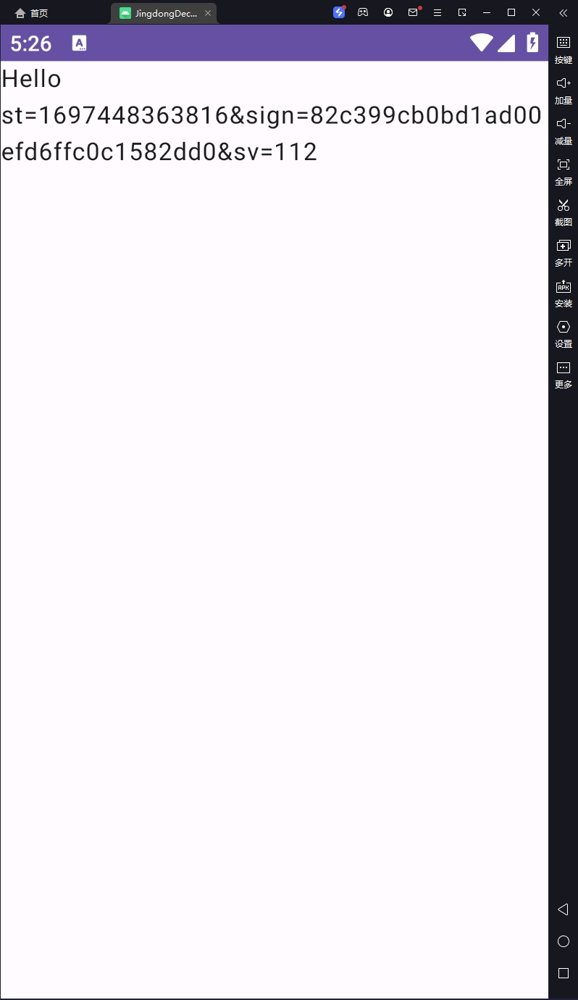
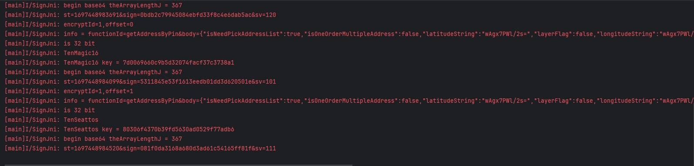

# jd_unidbg

这是对某电商平台逆向的一个记录

平台地址：aHR0cHM6Ly93d3cuamQuY29tLw==

本项目基于[unidbg](https://github.com/zhkl0228/unidbg)修改而来，感谢原作者的无私奉献

jdk版本要求：1.8，否则会报sun.security.pkcs.PKCS7的相关错误

前提条件：先通过反编译apk拿到源码，这样的工具一大堆，我这用的是jadx，然后通过源码找到加密sign的方法并进行hook，
hook脚本在另一个项目里[hook](https://github.com/A1anSong/jdsecskill/tree/main/hook)

本项目起因就是由一次hook引起的，hook的是一个native方法

但是这个方法的实现是在so里面的（[libjdbitmapkit.so](unidbg-android/libjdbitmapkit.so)）， 所以需要先加载so，然后再调用其中的方法，做了以下尝试：

1. 使用IDA生成伪代码来理解逻辑，发现这个so文件牵涉到的方方面面调用太多了，短时间内理解逻辑并不靠谱，大大提高了研究成本，故而寻找其他方法
2. 突发奇想直接新建一个android项目，想直接通过JNI调用这个加密的方法，然后通过socket通讯来传递加密信息，android能够成功运行，但是10秒左右会崩溃退出，所以肯定是还有一些其他的检测没有通过
   （android项目很简单，随便写写就行了，源码不做探讨）
   
3. 也尝试过[AndroidNativeEmu](https://github.com/AeonLucid/AndroidNativeEmu)，但是这个项目已经很久没有更新了，而且也没有找到合适的使用方法，故而放弃
4. 无意中发现了[unidbg](https://github.com/zhkl0228/unidbg)
   ，一次次调试下，终于成功了，直接给项目[jdsecskill](https://github.com/A1anSong/jdsecskill)进行调用即可
   

## 使用方法

9998端口是用来接收需要加密的数据并返回加密结果的，可以自行修改

考虑到可能涉及的法律问题，故部分核心源码不放出，有需要延续这个思路继续扩展即可

## License

- unidbg uses software libraries from [Apache Software Foundation](http://apache.org).
- unidbg developer Idea enterprise licenses are supported by [Jetbrains](https://www.jetbrains.com?from=unidbg).
- [IntelliJ IDEA](https://www.jetbrains.com/idea?from=unidbg) can be used to edit unidbg sources.
- 

## 联系

[交流方式](https://github.com/A1anSong#wechat-qr-code)